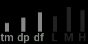

a shimmery reverb for norns

## control

there are three pages, **filter**, **mix**, and **edit**. navigate using key 2/3. 
key 1 is **alt**.

### filter

this is the input filter.

encoder 1: filter type. lowpass, or highpass.
encoder 2: filter cutoff
encoder 3: filter resonance

### mix

encoder 1: dry level
encoder 2: wet level
encoder 3: shimmer amount/feedback

### edit

encoder 1: reverb time
encoder 2: reverb dampening
encoder 3: early diffusion shape

holding alt shifts control to reverb eq/filtering
alt + encoder 1: low attenuator
alt + encoder 2: mid attenuator
alt + encoder 3: high attenuator

## parameters

