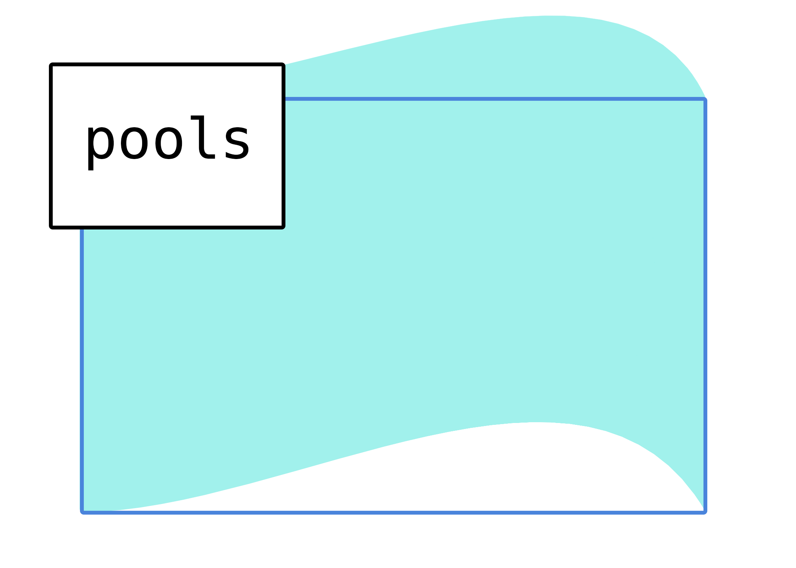
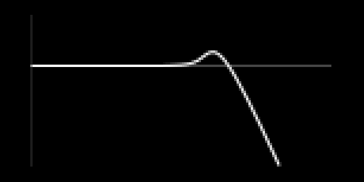
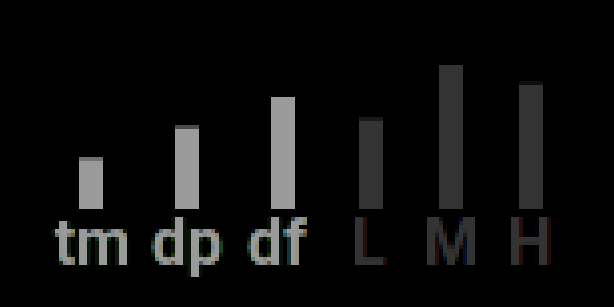

a shimmery reverb for norns

# control

there are three pages, **filter**, **mix**, and **edit**. navigate using key 2/3. 
key 1 is **alt**.

### filter

this is the input filter.

* encoder 1: filter type. lowpass, or highpass.
* encoder 2: filter cutoff
* encoder 3: filter resonance

### mix

* encoder 1: dry level
* encoder 2: wet level
* encoder 3: shimmer amount/feedback

### edit

* encoder 1: reverb time
* encoder 2: reverb dampening
* encoder 3: early diffusion shape

holding alt shifts control to reverb eq/filtering.

* alt + encoder 1: low attenuator
* alt + encoder 2: mid attenuator
* alt + encoder 3: high attenuator

*nb: you can adjust the low/mid/high crossover frequencies via the params menu*

## parameters

* dry - dry level
* wet - wet level
* shimmer - shimmer level/feedback
----
* freq - input filter cutoff
* res - input filter resonance
* gain - input filter gain
* type - input filter type (lowpass/highpass)
----
* time - reverb time/t60
* damp - reverb dampening
* size - reverb size
* diff - early diffusion shape
* mod depth - delay line modulation depth
* mod freq - delay line modulation rate
----
* low x - reverb eq/ low attenuator
* mid x - reverb eq/ mid attenuator
* high x - reverb eq/ high attenuator
* lowband - low/mid crossover freq
* highband - high/mid crossover freq
----
* pitchDisp - pitch shifting, random pitch variation
* timeDisp - pitch shifting delay
* pitchRatio - pitch shifting freq (1 is nominal pitch rate, 2 is an octave, 4 is two octaves etc...)
